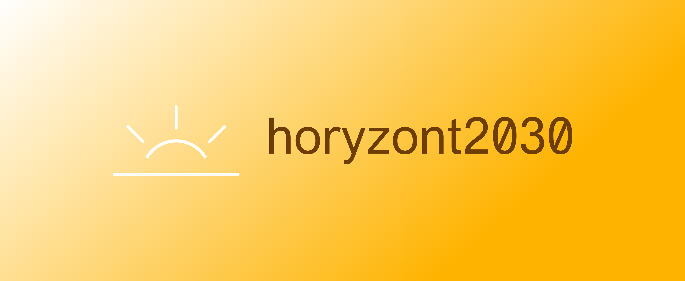
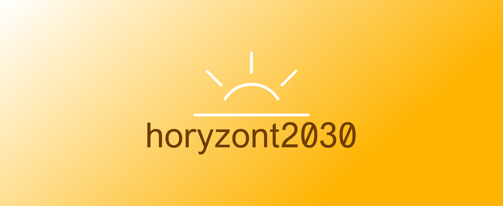

[horyzont2030.pl - O projekcie horyzont2030](http://www.horyzont2030.pl/)

# Logo horyzont 2030

## Font
Font in use <a target="_blank" href="https://www.fontspring.com/fonts/abstrkt/vremena">vremenagroteskbook</a> designed by
<a target="_blank" href="">ABSTRKT</a>
and licensed under
<a target="_blank" href="https://www.fontsquirrel.com/license/vremena-grotesk">Custom EULA.</a>
  Icon Designed by
  <a target="_blank" href="https://thenounproject.com/yardenoon">Yarden Gilboa</a>
  
## Colors

### Font
  
    #6D3D02

### Slogan
  
    #ffffff

### Background
  
    #FFFFFF, #FEB300

### Icon
  
    #ffffff

## Logo images

## 1

## 2

